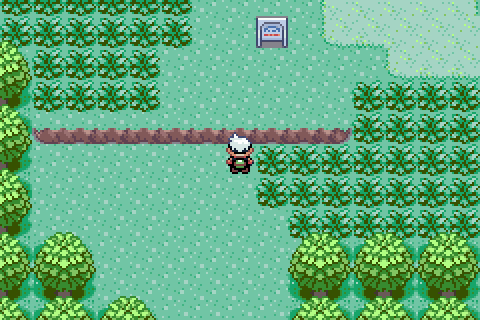

# Emerald Arena

Pokémon Emerald with real-time battles.

Move freely. Dodge attacks. Break rocks. Your team keeps its experience.
The arena runs inside the GBA game, with Emerald's own damage and save system.

[**Download Emerald Arena — ZIP**](https://github.com/GBurgardt/pokemon-emerald-arena/releases/download/v0.3.2/Emerald-Arena-0.3.2.zip) ·
[Installation guide](PLAY.md) · [Watch gameplay](#watch-gameplay) · [Release notes](RELEASE.md)

[**How to play · 1 minute video (MP4)**](https://github.com/GBurgardt/pokemon-emerald-arena/releases/download/v0.3.2/emerald-arena-walkthrough.mp4)
Download, prepare your game, play a battle and save. Includes restarting with CONTINUE.

You need your own unmodified **Pokémon Emerald (USA/Europe)** ROM and a GBA
emulator. No account, payment or compiling required. Prepare it on a computer;
then play on your computer or transfer the finished `.gba` to your handheld or phone.

## Start playing

1. **Download and extract the ZIP.** Open `Prepare-Emerald-Arena.html` in your browser.
2. **Choose your Emerald `.gba`.** Wait for verification, then click **Download game**.
   Your ROM stays on your device. Internet is needed once for the animations.
3. **Open the downloaded `.gba` in your GBA emulator.** On a fresh save, highlight
   **NEW GAME** and press **SELECT** for the practice team. In the field, press
   **L + R together** to start a battle.

The browser prepares the file; **the emulator plays the game**. After setup,
the game works offline. [Need help or the keyboard controls?](PLAY.md)

## Watch gameplay

[**Download video — MP4 with sound**](https://github.com/GBurgardt/pokemon-emerald-arena/raw/refs/heads/main/media/emerald-arena-17s.mp4)
· [GIF](media/emerald-arena-17s.gif)

17 seconds of actual gameplay: walking through the grass, then an arena battle.

## Controls

| GBA control | Action |
|---|---|
| Direction buttons | Move in eight directions |
| A | Attack; hold a direction to aim |
| B + a direction | Dodge |
| L / R | Previous / next move |
| START | Pause and help |
| SELECT | Switch to classic battle |
| L + R in the field | Next practice opponent |

Save from the field menu. Practice encounters do not heal or reset your team.
Regular saves keep their encounters and do not receive the demo party.

## What's included

- 12 animated Pokémon: Charizard, Blastoise, Eevee, Dragonite, Scizor, Blaziken,
  Treecko, Poochyena, Bulbasaur, Squirtle, Grovyle and Sceptile.
- 10 move profiles: Pound, Tackle, Quick Attack, Leer, Absorb, Water Gun,
  Wing Attack, Slam, Peck and Scratch.
- Breakable rocks, wood, foliage, crystals and explosive pods.
- Enemies that navigate obstacles, aim and dodge, with level-based reactions.
- Native HP, PP, experience, leveling and saves. Classic battles remain available.

This is a playable experiment, not a fully rebalanced adventure.
Moves and situations not yet adapted use classic battles. Flamethrower is one
example: Charizard's arena move is Wing Attack.

## Build and adapt

[Build instructions](BUILD.md) · [Credits](CREDITS.md) · [Release notes](RELEASE.md)
· [How the battles work](HOW-IT-WORKS.md) · [Report a problem](https://github.com/GBurgardt/pokemon-emerald-arena/issues/new?template=bug_report.yml)

The [landing source](site/) and [capture tools](media/capture-source/) are included.

The source is an overlay and patch for
[pret/pokeemerald](https://github.com/pret/pokeemerald), pinned to
`5eff78649e7170a877b961ef0b3da13b81a16038`.

The download includes a compiled delta and a local installer, not a ROM, save
or sprite sheets. The installer fetches pinned animation sources, prepares them
locally and verifies the final ROM against the tested release.

New project code is [MIT](LICENSE). This is an independent, unofficial project.
